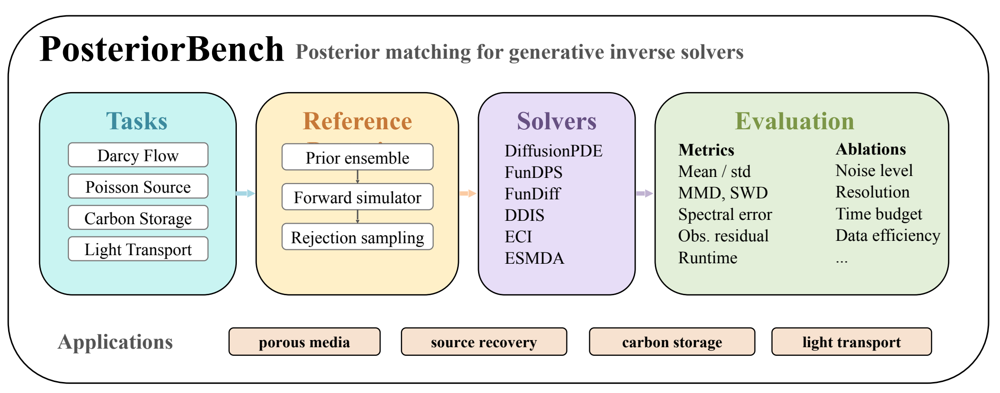
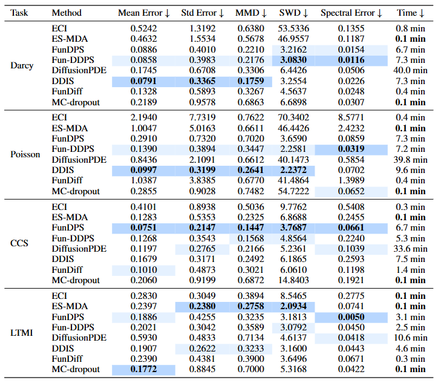

# PosteriorBench: From Point Estimates to Posterior Matching in Evaluating Generative Inverse Solvers

Official implementation of **PosteriorBench**, a benchmark for evaluating whether
generative scientific inverse solvers recover full posterior distributions rather
than only accurate point estimates.

PosteriorBench provides four physics-based inverse tasks, high-fidelity reference
posteriors, and a common evaluation suite for posterior-generating solvers.



[Paper](./assets/PosteriorBench.pdf)

## Setup

Run commands from the repository root with the intended Python environment
activated.

Most methods use the Torch/CUDA environment described by `requirements.txt`:

```shell
python -m venv .venv
source .venv/bin/activate
pip install -r requirements.txt
```

FunDiff uses a separate JAX environment. Create that environment wherever is
appropriate for the machine, then source the helper before running FunDiff jobs:

```shell
POSTERIORBENCH_FUNDIFF_VENV=/path/to/fundiff-jax-venv source fundiff_jax_env.sh
```

The PosteriorBench datasets are hosted on
[Hugging Face](https://huggingface.co/datasets/anonymousmay/PosteriorBench).

The commands below assume the Hugging Face `save_to_disk` layout is available at
`hf_reference_materialized/`:

```text
hf_reference_materialized/
├── PDEFieldDataset_hf/
│   └── {Poisson_Multimode,Darcy_Multimode,LTMI_Multimode,CCS_Multimode}/
└── PosteriorDataset_hf/
    └── {Poisson_Multimode,Darcy_Multimode,LTMI_Multimode,CCS_Multimode}/
```

Checkpoint artifacts are expected under `artifacts/checkpoints/`.

## Usage

Training configs live under `configs/training/`. Evaluation profiles live under
`configs/evaluations/`.

```shell
# Example: train a FunDPS prior on Darcy.
python train_fundps.py \
  -c configs/training/darcy_fundps_64_pretrain.yml \
  --name darcy_fundps_pretrain

# Example: generate posterior samples for the first 50 Darcy cases.
DATASET=darcy
METHOD=fundps
CHECKPOINT=artifacts/checkpoints/fundps/darcy_fundps.pkl

python -m posteriorbench.generate \
  --dataset "${DATASET}" \
  --method "${METHOD}" \
  --cases "hf_reference_materialized" \
  --checkpoint "${CHECKPOINT}" \
  --profile "configs/evaluations/${METHOD}_${DATASET}.yaml" \
  --output "outputs/${METHOD}_${DATASET}_first50" \
  --num-samples 100 \
  --batch-size 10 \
  --max-cases 50

# Evaluate the generated posterior ensemble against the reference posterior.
python -m posteriorbench.evaluate \
  --dataset "${DATASET}" \
  --cases "hf_reference_materialized" \
  --predictions "outputs/${METHOD}_${DATASET}_first50" \
  --output "outputs/${METHOD}_${DATASET}_first50_eval" \
  --training-source "hf_reference_materialized/PDEFieldDataset_hf" \
  --max-cases 50
```

Use `DATASET` in `{poisson,darcy,light_transport,ccs}` and `METHOD` in
`{fundps,diffusionpde,funddps,ddis,fundiff,eci,esmda,mcdropout}`.

Typical checkpoint paths are:

| Method | `CHECKPOINT` |
| --- | --- |
| `fundps` | `artifacts/checkpoints/fundps/${DATASET}_fundps.pkl` |
| `diffusionpde` | `artifacts/checkpoints/diffusionpde/${DATASET}_diffusionpde.pkl` |
| `funddps` | `artifacts/checkpoints/funddps/${DATASET}_funddps.pkl` |
| `ddis` | `artifacts/checkpoints/ddis/${DATASET}_ddis.pkl` |
| `fundiff` | `artifacts/checkpoints/fundiff/${DATASET}_fundiff` |
| `eci` | `artifacts/checkpoints/eci/${DATASET}_eci.pt` |
| `esmda` | `hf_reference_materialized/PDEFieldDataset_hf/<HF dataset name>` |
| `mcdropout` | `artifacts/checkpoints/mcdropout/${DATASET}_mcdropout.pt` |

Write accepted formal outputs to `outputs_canonical/`; use `outputs/` for new
candidates until they are reviewed.

## Results

Table 2 from the paper reports the main PosteriorBench results. Lower is better
for all metrics.


