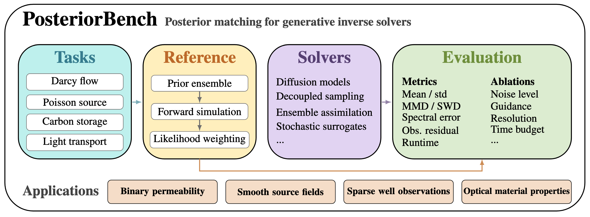
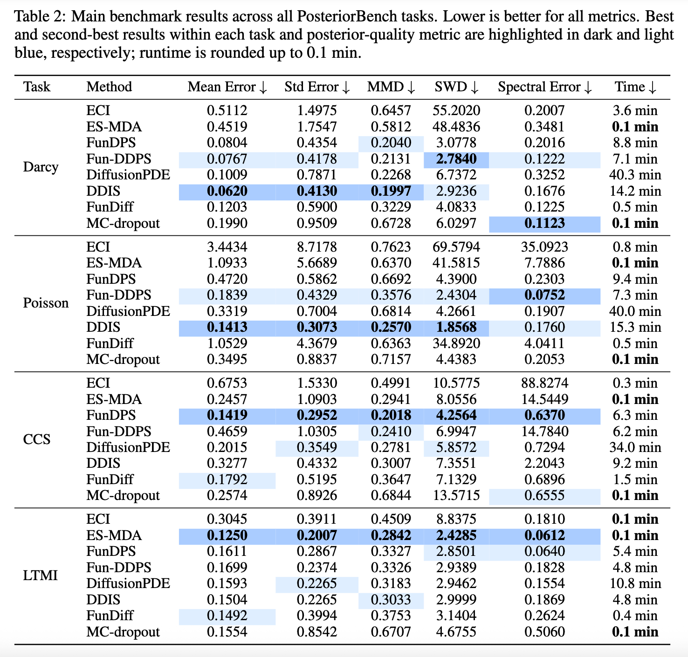

# PosteriorBench: From Point Estimates to Posterior Matching in Evaluating Generative Inverse Solvers

**🎉 We are thrilled to announce that our work has been accepted to NeurIPS 2026! 🎉**

[📦 Arxiv](https://arxiv.org/abs/2609.20794) &nbsp;&nbsp; [📝 Paper](https://arxiv.org/pdf/2609.20794) &nbsp;&nbsp; [🤗 HuggingFace ](https://huggingface.co/datasets/jcy20/PosteriorBench)

Official implementation of **PosteriorBench**, a benchmark for evaluating whether generative scientific inverse solvers recover full posterior distributions, beyond accurate single estimates.

PosteriorBench provides four physics-based inverse tasks, high-fidelity reference posteriors, and a common evaluation suite for posterior-generating solvers.



## Setup

Run commands from the repository root with the intended Python environment activated.

Most methods use the PyTorch/CUDA environment described by `requirements.txt`:

```shell
python -m venv .venv
source .venv/bin/activate
pip install -r requirements.txt
```

FunDiff uses a separate JAX environment. After creating that environment, source the helper for FunDiff experiments:

```shell
export POSTERIORBENCH_FUNDIFF_VENV=/path/to/fundiff-jax-venv
source ./fundiff_jax_env.sh
```

From the repository root, download the [PosteriorBench datasets](https://huggingface.co/datasets/jcy20/PosteriorBench) from Hugging Face:

```shell
hf download anonymousmay/PosteriorBench --repo-type dataset --local-dir ./data
```

The command saves the training fields and reference posteriors under `./data` with the following layout:

```text
data/
├── PDEFieldDataset_hf/     # For training
│   ├── Poisson_Multimode/
│   ├── Darcy_Multimode/
│   ├── LTMI_Multimode/
│   └── CCS_Multimode/
└── PosteriorDataset_hf/    # For evaluation
    ├── Poisson_Multimode/
    ├── Darcy_Multimode/
    ├── LTMI_Multimode/
    └── CCS_Multimode/
```

Checkpoint artifacts are expected under `artifacts/checkpoints/`.

## Usage

Training configs live under `configs/training/`. Evaluation profiles live under `configs/evaluations/`.
Training configs and evaluation defaults use the datasets under `./data`.

```shell
# Example: train a FunDPS prior on Darcy.
python train_fundps.py \
  -c configs/training/darcy_fundps_64_pretrain.yml \
  --name darcy_fundps_pretrain

# Example: generate posterior samples for the first 50 Darcy cases.
DATASET=darcy
METHOD=fundps
CHECKPOINT=artifacts/checkpoints/fundps/darcy_fundps.pkl

python -m posteriorbench.generate \
  --dataset "${DATASET}" \
  --method "${METHOD}" \
  --case-source "./data" \
  --checkpoint "${CHECKPOINT}" \
  --profile "configs/evaluations/${METHOD}_${DATASET}.yaml" \
  --output "outputs/${METHOD}_${DATASET}_first50" \
  --num-samples 100 \
  --batch-size 10 \
  --max-cases 50

# Evaluate the generated posterior ensemble against the reference posterior.
python -m posteriorbench.evaluate \
  --dataset "${DATASET}" \
  --case-source "./data" \
  --predictions "outputs/${METHOD}_${DATASET}_first50" \
  --output "outputs/${METHOD}_${DATASET}_first50_eval" \
  --training-source "./data/PDEFieldDataset_hf" \
  --max-cases 50
```

Use `DATASET` in `{poisson,darcy,light_transport,ccs}` and `METHOD` in `{fundps,diffusionpde,funddps,ddis,fundiff,eci,esmda,mcdropout}`.

Typical checkpoint paths are:

| Method | `CHECKPOINT` |
| --- | --- |
| `fundps` | `artifacts/checkpoints/fundps/${DATASET}_fundps.pkl` |
| `diffusionpde` | `artifacts/checkpoints/diffusionpde/${DATASET}_diffusionpde.pkl` |
| `funddps` | `artifacts/checkpoints/funddps/${DATASET}_funddps.pkl` |
| `ddis` | `artifacts/checkpoints/ddis/${DATASET}_ddis.pkl` |
| `fundiff` | `artifacts/checkpoints/fundiff/${DATASET}_fundiff` |
| `eci` | `artifacts/checkpoints/eci/${DATASET}_eci.pt` |
| `mcdropout` | `artifacts/checkpoints/mcdropout/${DATASET}_mcdropout.pt` |

## Results

Table 2 from the paper reports the main PosteriorBench results. Lower is better for all metrics.


